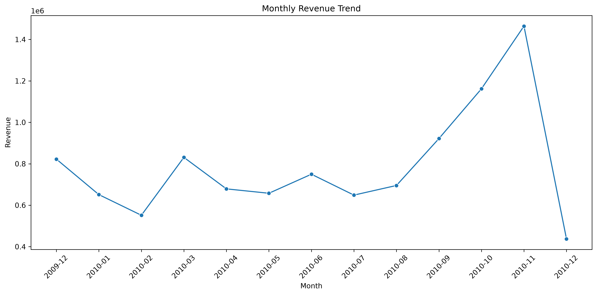
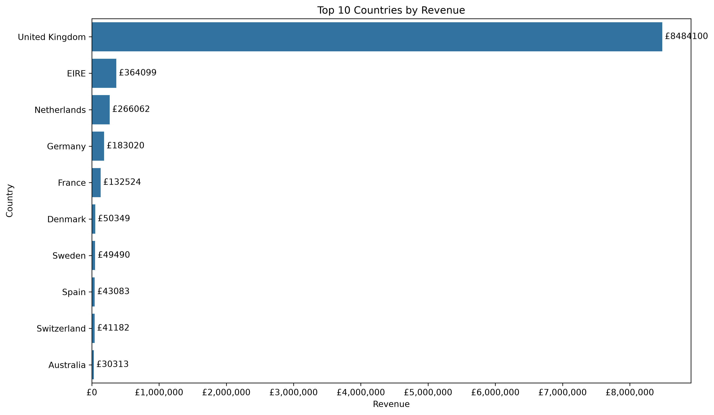
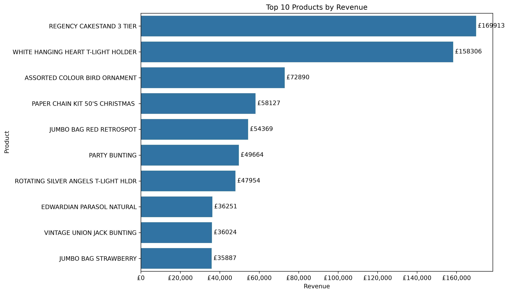
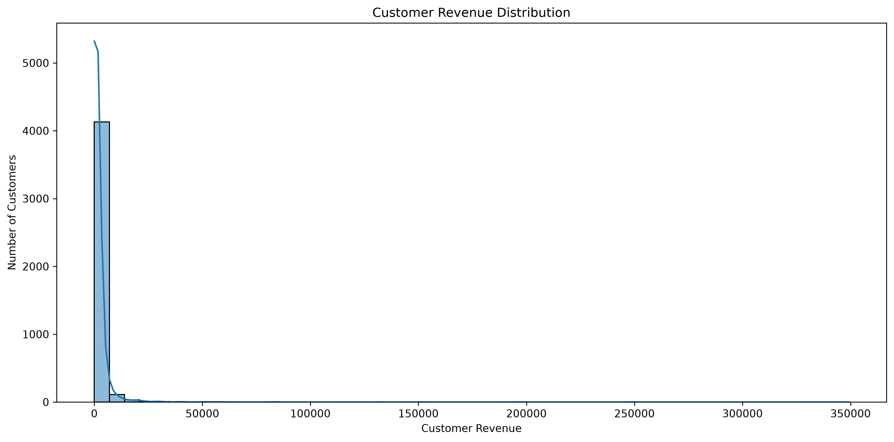
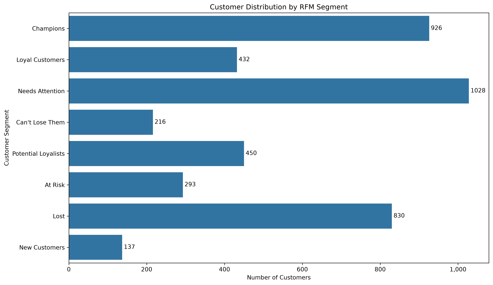
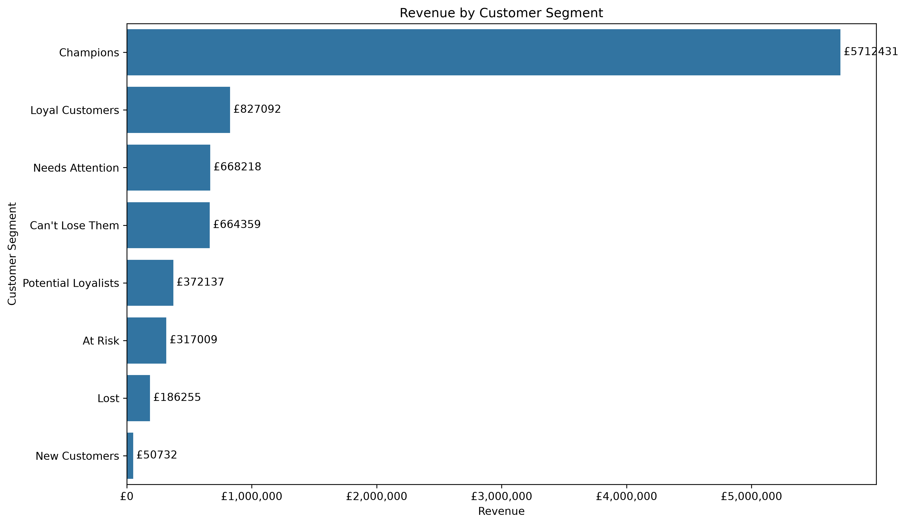
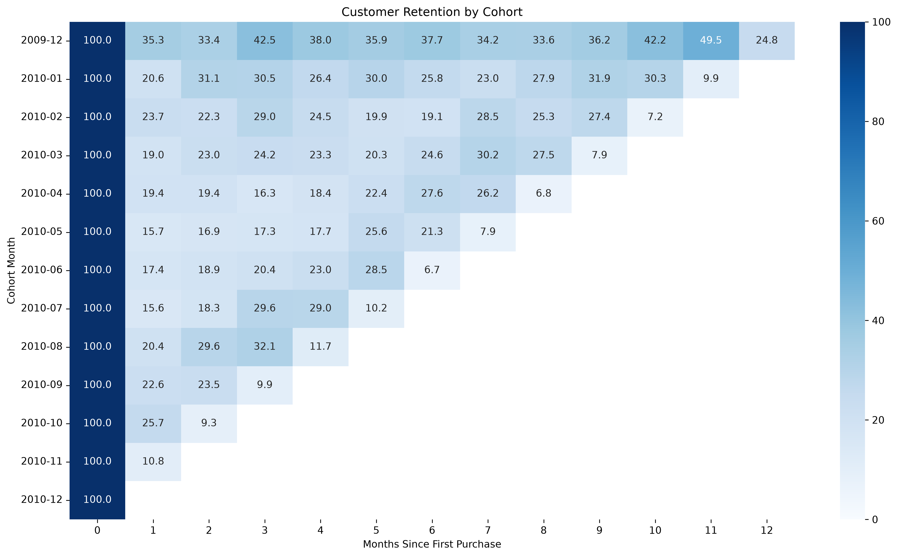

# E-Commerce Sales & Customer Analytics

## Project Overview

An end-to-end data analysis project using Python, Pandas, NumPy, Matplotlib, Seaborn, SQLite, and SQL to analyze e-commerce transaction data.

The project focuses on understanding sales performance, customer purchasing behavior, product performance, customer retention, RFM segmentation, and returns/cancellations.

The goal is to transform raw transactional data into actionable business insights.

---

## Business Questions

This project answers questions such as:

- How is revenue changing over time?
- Which products generate the most revenue and sales volume?
- Which countries generate the most revenue?
- Who are the highest-value customers?
- How many customers are repeat vs one-time buyers?
- Which customer segments contribute the most revenue?
- How well are customers retained after their first purchase?
- What is the impact of returns and cancellations?
- How concentrated is revenue among high-value customers?
- What relationships exist between customer frequency and monetary value?

---

## Dataset

The project uses the **Online Retail II** transactional dataset.

The dataset contains e-commerce transactions with information including:

- Invoice
- Stock Code
- Product Description
- Quantity
- Invoice Date
- Price
- Customer ID
- Country

The original dataset is stored locally and is not included in the GitHub repository because of its size and licensing/data-distribution considerations.

---

## Data Cleaning

The raw transaction data was cleaned before analysis.

Key cleaning steps included:

- Handling missing customer IDs
- Removing duplicate records
- Identifying cancelled transactions
- Identifying negative quantities
- Identifying zero and negative prices
- Creating a revenue column
- Converting transaction dates to datetime
- Creating monthly purchase periods
- Preparing customer-level datasets for RFM and cohort analysis

### Cleaned Dataset Summary

- Original rows: 525,461
- Cancelled transactions: 10,206
- Missing customer IDs: 107,927
- Duplicate rows: 6,865
- Cleaned transactions: 506,290
- Orders: 22,100
- Customers: 4,314
- Products: 4,316
- Total revenue: £10.27M

---

## Analysis

### Sales Analysis

Analyzed:

- Total revenue
- Total units sold
- Number of orders
- Average order value
- Monthly revenue trends

### Product Analysis

Analyzed:

- Top products by revenue
- Top products by units sold
- Product-level sales performance

### Country Analysis

Analyzed:

- Revenue by country
- Top-performing international markets
- Revenue per customer

### Customer Analysis

Analyzed:

- Customer revenue
- Repeat vs one-time customers
- Customer purchasing behavior
- Customer revenue distribution

### RFM Analysis

Performed RFM analysis using:

- Recency
- Frequency
- Monetary value

Customers were segmented into:

- Champions
- Loyal Customers
- Potential Loyalists
- New Customers
- Needs Attention
- At Risk
- Can't Lose Them
- Lost

### Cohort & Retention Analysis

Performed cohort analysis to understand customer retention over time.

Key retention metrics included:

- Month 1 retention
- Month 3 retention
- Average retention by cohort month

### Returns & Cancellation Analysis

Analyzed:

- Cancelled transactions
- Cancelled units
- Cancelled revenue
- Return rates
- Genuine returns vs special/operational transactions
- Products with high return activity

### Statistical Analysis

Analyzed:

- Revenue distribution
- Mean vs median
- Revenue skewness
- Percentiles
- Outliers
- Correlations between Recency, Frequency, and Monetary value
- Revenue concentration among high-value customers

### SQL Analysis

SQLite and SQL were used to demonstrate:

- Aggregations
- GROUP BY
- COUNT and COUNT DISTINCT
- CTEs
- CASE WHEN
- Window functions
- Customer ranking

SQL was used selectively to complement the Python analysis rather than duplicate the entire project.

---

## Key Insights

### Revenue Concentration

The top 10% of customers generated approximately **59.92% of total revenue**.

This demonstrates a strong concentration of revenue among high-value customers.

### RFM Segmentation

Champions represented approximately **21.47% of customers** while contributing approximately **64.93% of revenue**.

This highlights the importance of retaining and rewarding high-value customers.

### Customer Retention

Average Month 1 retention was approximately **20.52%**.

This indicates an opportunity to improve early customer retention and encourage customers to make a second purchase.

### Customer Revenue Distribution

Customer revenue was highly right-skewed:

- Mean: £2,040.41
- Median: £701.62
- Revenue skewness: 24.00

The median therefore provides a more representative view of the typical customer than the mean.

### Returns & Cancellations

The initial cancellation rate was approximately **1.94% of transactions**.

Further investigation showed that the dataset contains operational/special transactions such as postage, manual adjustments, damaged items, and other non-standard records.

Separating these transactions from genuine customer returns produced a more meaningful genuine return revenue rate of approximately **3.42%**.

---

## Visualizations

Selected visualizations produced during the analysis include:

### Monthly Revenue



### Top 10 Countries by Revenue



### Top 10 Products by Revenue



### Customer Revenue Distribution



### RFM Customer Segments



### Revenue by Customer Segment



### Cohort Retention



---

## Technologies

- Python
- Pandas
- NumPy
- Matplotlib
- Seaborn
- SQLite
- SQL
- Jupyter Notebook

---
## How to Run

1. Clone the repository:

```bash
git clone <repository-url>
cd Ecommerce-Sales-Customer-Analytics


2. Create and activate a virtual environment:
python -m venv venv
venv\Scripts\activate

3. Install the required libraries:
pip install -r requirements.txt

4. Obtain the Online Retail II dataset separately and place it in the data/ directory.

5. Open the notebooks in src/ using VS Code or Jupyter Notebook.
---

## Project Structure

```text
Ecommerce-Sales-Customer-Analytics/
│
├── data/
│   └── Local datasets
│
├── src/
│   ├── clean_data.ipynb
│   ├── country_analysis.ipynb
│   ├── customer_analysis.ipynb
│   ├── data_quality.ipynb
│   ├── inspect_data.ipynb
│   ├── load_data.ipynb
│   ├── product_analysis.ipynb
│   ├── Return_analysis.ipynb
│   ├── sales_analysis.ipynb
│   ├── statistical_analysis.ipynb
│   ├── time_analysis.ipynb
│   └── visualization.ipynb
│
├── notebooks/
│   └── database.ipynb
│
├── outputs/
│   ├── cohort_retention_heatmap.png
│   ├── customer_revenue_distribution.png
│   ├── customer_segment_distribution.png
│   ├── monthly_revenue.png
│   ├── revenue_by_customer_segment.png
│   ├── rfm_frequency_vs_revenue.png
│   ├── top_10_countries_revenue.png
│   ├── top_10_products_revenue.png
│   └── top_10_products_units.png
│
├── .gitignore
├── README.md
└── requirements.txt